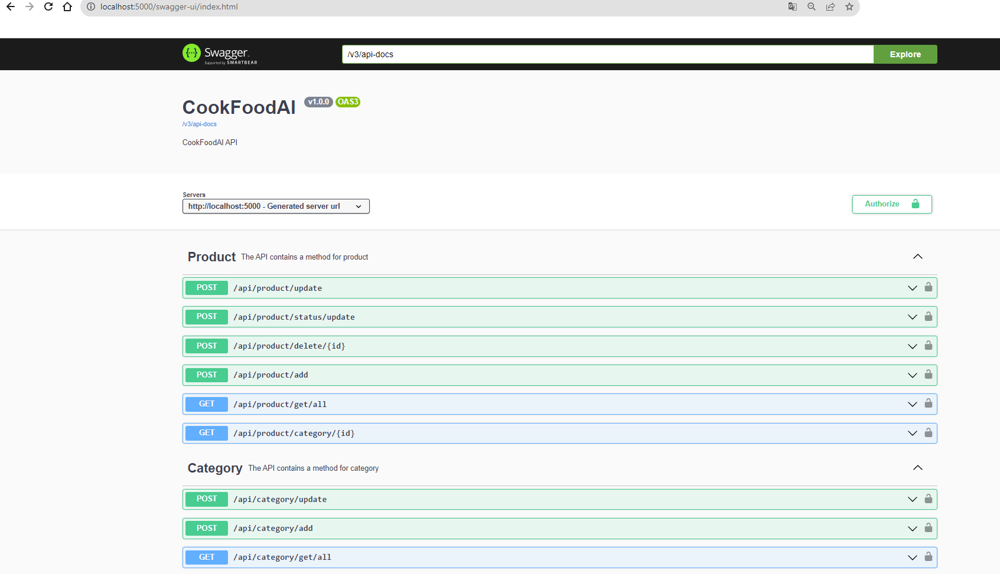

# CookFoodAI #

### About ###
The use of artificial-intelligence (AI) in e-commerce in a food store

** IN PROGRESS  **

Start project: 01.03.2024

# CookFoodAI Backend service

[URL] [http://localhost:5000/]()

- [Java 17+]
- [Maven 3+]
- [Spring Boot 3.x]
- [Spring Security 6.x]
- [Hibernate]
- [JPA]
- [OpenAPI Swagger]
- [JWT]
- [Mockito 5.x] & [jUnit  5] TO DO
- [Spring AI]  TO DO [https://docs.spring.io/spring-ai/reference/index.html]() 

##  OpenAI
Pricing - OpenAI, [https://openai.com/pricing?ref=muneebkhawaja.com]()

For OpenAI's API. Go to [https://openai.com/](), sign up for an account, and generate an API key.

** properties :** [./src/main/resources/application.properties]()

``` 
# OpenAI key
spring.ai.openai.api-key=your open_AI key
```

```
# Security JWT Token key  # Encode to Base64  (HS256)
security.jwt.secret.key=your security key with encode to Base64 
```

## API ##
[Swagger UI]  [http://localhost:5000/swagger-ui/index.html]()

#### Registration  ####
[Request POST: ]

Authorization: Bearer {{acctoken}}
```
{
"firstname": "Kylie",
"lastname": "Rey",
"email": "Kylie.Rey@exaple.com",
"password": "#34pc3RyYXRvciJdfQ.f"
}
```
```
{
"expiration": 86400000,
"roles":USER,
"access_token": "eyJhbGciOiJ9.iIxMjM0NT....Y3ODkwIiwibmFt.JV_adQssw5c..",
"refresh_token":"eyJhbGciOiJ9.iIxMjM0NT....Y3ODkwIiwibmFt.5MDIssw5c..",
}
```
#### Receipts AI ####
[Request GET: api/recipe/getAI?category=lunch&people=2 ]

Authorization: Bearer {{acctoken}}
```
{
   "receipts":[
      {
         "name":"Spaghetti with Tomato Sauce",
         "category":"Italian",
         "ingredients":[
            {
               "quantity":200,
               "unit":"grams",
               "name":"Pasta",
               "calories":200
            },
            {
               "quantity":1,
               "unit":"cup",
               "name":"Tomato Sauce",
               "calories":150
            },
            {
               "quantity":100,
               "unit":"grams",
               "name":"Mozzarella Cheese",
               "calories":100
            }
         ],
         "preparation":"Cook pasta according to package instructions. Heat tomato sauce in a pan. Mix cooked pasta with tomato sauce. Top with mozzarella cheese and serve hot."
      },
      {
         "name":"Chicken Fajitas",
         "category":"Mexican",
         "ingredients":[
            {
               "quantity":300,
               "unit":"grams",
               "name":"Chicken Breast",
               "calories":250
            },
            {
               "quantity":2,
               "unit":"tablespoons",
               "name":"Taco Seasoning",
               "calories":150
            },
            {
               "quantity":1,
               "unit":"piece",
               "name":"Bell Peppers",
               "calories":100
            }
         ],
         "preparation":"Slice chicken breast and bell peppers. Season chicken with taco seasoning. Cook chicken and bell peppers in a pan until chicken is cooked through. Serve with tortillas and your favorite toppings."
      },
      {
         "name":"Chicken Stir Fry with Rice",
         "category":"Asian",
         "ingredients":[
            {
               "quantity":1,
               "unit":"cup",
               "name":"Rice",
               "calories":300
            },
            {
               "quantity":200,
               "unit":"grams",
               "name":"Chicken Breast",
               "calories":200
            },
            {
               "quantity":150,
               "unit":"grams",
               "name":"Mixed Vegetables",
               "calories":100
            }
         ],
         "preparation":"Cook rice according to package instructions. Slice chicken breast and stir fry with mixed vegetables in a pan. Season with soy sauce and serve hot over cooked rice."
      }
   ]
}
```



## Database ###
[http://localhost:5000/h2-console]()

**URL:** [jdbc:h2:mem:testdb;OLD_INFORMATION_SCHEMA=TRUE;DATABASE_TO_UPPER=false;]()

**User**:sa

**pass**:sa

## To build and run the project
```
mvn clean install
```
